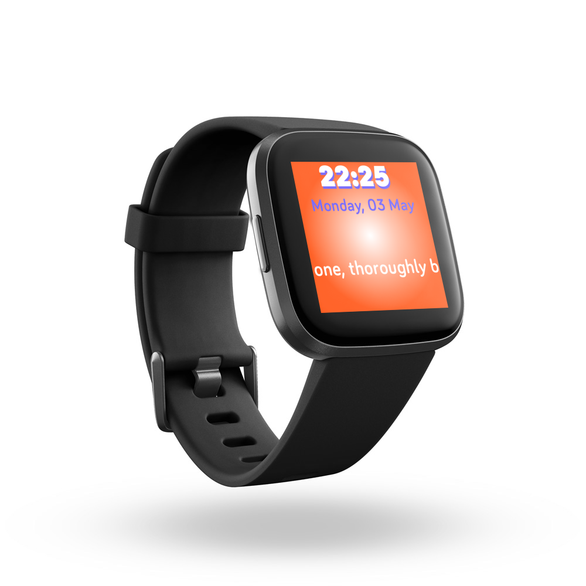

# Vedanta Principles


 > a Fitbit Clockface that shows you:

 - **Time** 🕒
 - **Day** 📅
 - **Date** 3️⃣1️⃣
 - And a **motivational quote** daily.

 ```
 To keep you positive towards life daily and stay strong. 💪💪
 ```

 All from [Vedanta or Quotes of Swami Vivekananda](https://en.wikiquote.org/wiki/Swami_Vivekananda)

 📥 You can download this Clockface from [here](https://gallery.fitbit.com/search?terms=vedanta%20Principles)

-----------------

> source code :
 
 - [SDK4](SDK4) : `Versa, Versa Light, Versa 2 and Ionic` 4️⃣

 - [SDK5](SDK5) : `Versa3, Sense` 5️⃣

-----------------




-----------------
